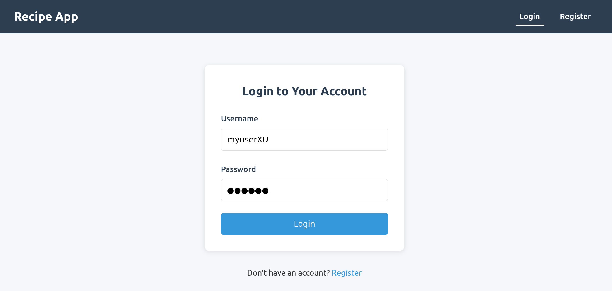
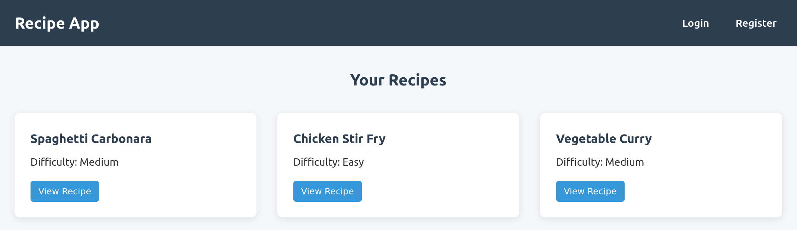
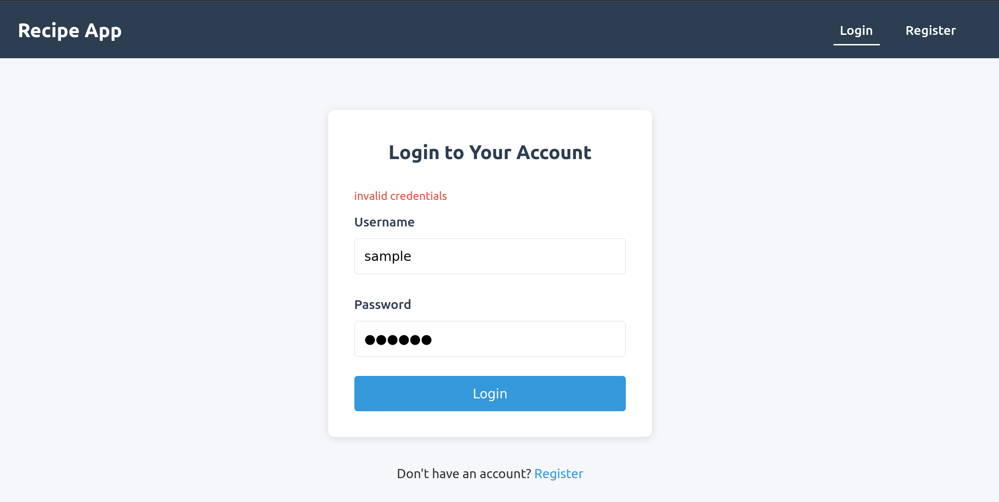

# Hooking up our auth server with our frontend

## Overview

Now it is time to implement the functinoality of `registering` and `logging` using
a `UI`.

## Requirements

Start from the repo you cloned and worked on from previous class [simple-auth-service](https://github.com/juan-instructor/simple-auth-service)

### Frontend token work

It is time to use the `UI` you built in the previous project and:

1. Implement the `login` functionality
2. Implement the `register` functionality
3. Once logged-in, going to `/recipes` from your `frontend`, the user should see
   all the recipes from the `backend`.

> [!NOTE]
> You must ensure there is a `/recipes` route on your backend which is also `PROTECTED`and
> only `logg-in` users can access!

> [!IMPORTANT]
> Use [react-router](https://reactrouter.com/) to create a SPA.
> `http://localhost:5173/register`, `http://localhost:5173/login`

### Sample of how your frontend should look/behave

`http://localhost:5173/login`

`http://localhost:5173/recipes`

`http://localhost:5173/login`

